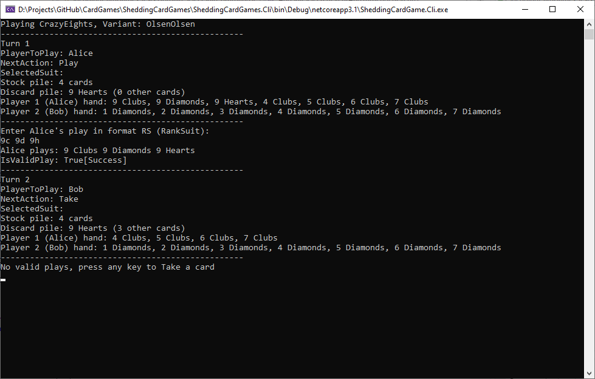
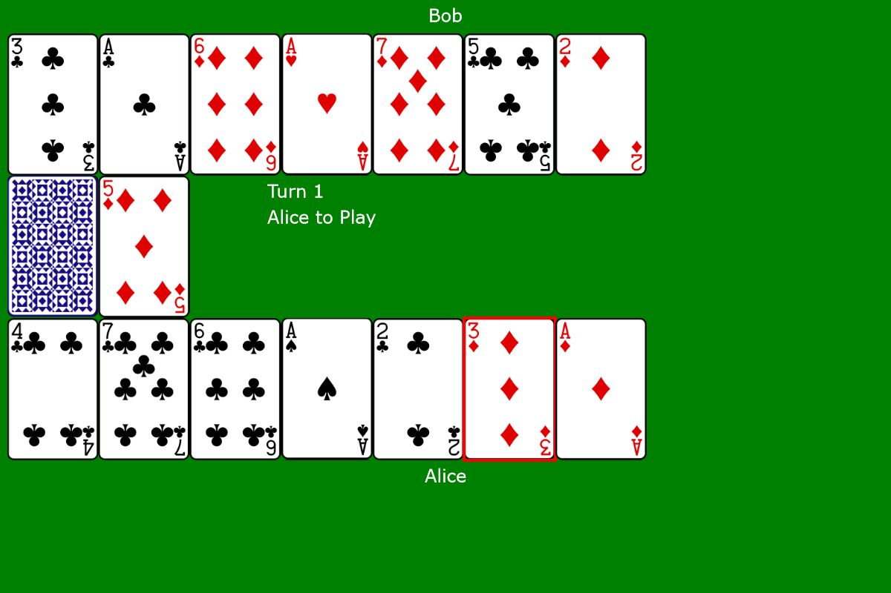

# Card Games

[Work in Progress]

A basic Card Shedding game (Crazy Eights) developed as TDD and software design practice.

## Rules
https://bicyclecards.com/how-to-play/crazy-eights/

There are two Variants
1. Basic Variant
1. Olsen Olsen Variant

### Basic Variant
Play a single Card. If there are no valid plays then take a single Card and pass.

### Olsen Olsen Variant
Has the same rules as the Basic Variant, with two differences.
Can play multiple Cards which match by rank. For example, if the top card on the Discard Pile is 9 Hearts, can play 9 Clubs, 9, Diamonds and 9 Hearts in one play.
If a Player has no valid plays, then they Take a card up to three times and then pass after the third Take.

## CLI

A CLI app to try out the game. Located in the project SheddingCardGame.Cli. Play cards by typing them. For example to play the 9 Clubs, 9 Diamonds and 9 Hearts type:
`9c 9d 9h`

## UI

An experimental Blazor app, in the project SheddingCardGame.UI. Play cards by clicking on them.

-----

## Design

### Concepts

Turn
Action

### Actions
Play
Take
SelectSuit

## Events
DealCompleted
Passed
Played
RoundWon
Shuffled
StartingPlayerChosen
SelectedSuit
Taken
TurnEnded

### Scenarios

#### Basic Variant
1. PlaySingle not Eight
1. PlaySingle Eight, SelectSuit
1. Take
1. PlaySingle not Eight, Won
1. PlaySingle Eight, Won

#### Olsen Olsen Variant
1. PlayMultiple not Eight
1. PlayMultiple Eight, SelectSuit
1. Take, PlayMultiple
1. Take, Take, PlayMultiple
1. Take, Take, Take, Pass
1. PlayMultiple not Eight, Won
1. PlayMultiple Eight, Won

### Design Decisions Log

##### 31/12/2020
[1] Introduce Turn type. Game will now return it from GetCurrentTurn(), rather than having properties, such as DiscardPile.

##### 04/01/2021
[2] Introduce Player type - holds Hand. Then can can have a CurrentPlayer pointer in the Game class which simplifies Play(). Will also be useful for implementing Win functionality later.

##### 05/01/2021
[3] Add GameSetup concept. Game runs the game, while GameSetup sets it up. Simplifies testing for Win functionality, also seperation of concerns.

[4] Add Board concept. Replacing GameSetup. Has low level methods for moving Cards around.

##### 09/01/2021
[5] Add Events for MoveDiscardPileToStock Pile. This allows visibility, making it testable.

##### 13/01/2021
[6] Add DiscardPile, StockPile types to make what these can do more explicit. Such as DiscardPile has a CardToMatch and RestOfCards.

##### 26/01/2021
[7] Add Domain and UiLogic folders, then can move UI Logic out of UI and make it testable.

##### 27/01/2021
[8] Split GameController into one class for Blazor, one shared between Blazor and CLI.

##### 31/01/2021
[9] Merge GameContoller back into Game to simplify.

##### 01/02/2021
[10] Create Initialise() in Game. Then can init the Game for tests and load/restore. Also migrate game state in GameState.

##### 13/04/2021
[11] Convert Game to Command pattern style

##### 28/04/2021
[12] Different variants of the same game can share their data structure/model. For example, for Crazy Eights, the Played Event has a card collection rather than a seperate version for the single-card play variant and the multi-card play variant. But there will be seperate Commands, as these are used to specifiy the rules of the variant.
		
##### 08/05/2021
[13] Deprecate returning all the valid moves - there are a lot permutations. Instead just check in the IsValidPlay method of a Command (also this is a simpler approach)