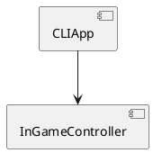
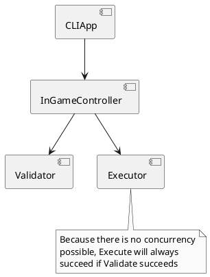

# Design - Rummy

Current:

```plantuml
@startuml
skinparam monochrome true

[CLIApp] --> [InGameController]

@enduml
```

Refactor to:

```plantuml
@startuml
skinparam monochrome true

[CLIApp] --> [InGameController]
[InGameController] --> [Validator]
[InGameController] --> [Executor]

note bottom of [Executor]
    Because there is no concurrency
    possible, Execute will always
    succeed if Validate succeeds
end note


@enduml
```
